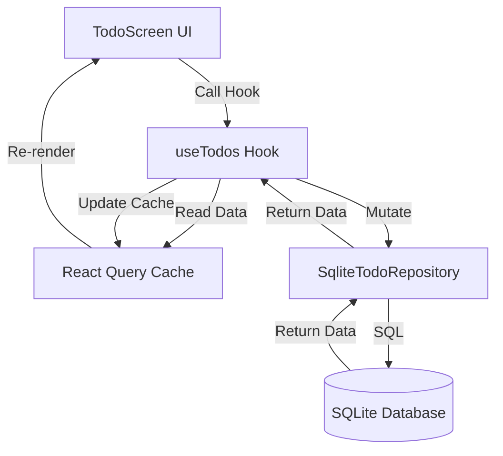

# Application Logic Flow

This document outlines how the LifeLog app initializes, routes users, and manages data flow.

## 1. Initialization Lifecycle

**Entry Point:** `app/_layout.tsx`

1.  **App Launch**: The app starts, and the `RootLayout` component renders.
2.  **Splash Screen Setup**: `SplashScreen.preventAutoHideAsync()` keeps the native splash screen visible while we load resources.
3.  **Database Init**:
    - `initDatabase()` from `src/db/client.ts` is called.
    - It creates/migrates the SQLite tables (`todos`, etc.) if they don't exist.
    - Once finished, `dbReady` state is set to `true`.
4.  **Display**:
    - If `dbReady` is false, we render nothing (or a loading view).
    - Once true, `SplashScreen.hideAsync()` is called, revealing the app.

## 2. Authentication & Routing (The Gatekeeper)

**File:** `app/_layout.tsx`
**Store:** `src/store/authStore.ts`

The app uses a **Segment-based Redirect** pattern to protect routes.

- **State**: `useAuthStore` checks AsyncStorage for a persisted `user` object.
- **Logic**:
  - **If User is NULL** AND not in `/onboarding` -> **Redirect to `/onboarding`**.
  - **If User EXISTS** AND is in `/onboarding` -> **Redirect to `/(tabs)`** (Dashboard).
- **Result**: The user is automatically routed to the correct screen based on their registration status.

## 3. Data Flow Architecture (The "Todo" Example)

We use a **Unidirectional Data Flow** with 3 distinct layers:

### Layer 1: The UI (`app/(tabs)/todos.tsx`)

- **Responsibility**: Rendering and User Interaction only.
- **Action**: Calls `useTodos()` hook.
- **Example**: User clicks "Add", component calls `addTodo({ title: 'New Task' })`.

### Layer 2: The Hook (`src/hooks/useTodos.ts`)

- **Responsibility**: Managing State (Server State) & Caching.
- **Tool**: `@tanstack/react-query`.
- **Reading**: `useQuery` calls `repo.getAll()`. The result is cached.
- **Writing**: `useMutation` calls `repo.create()`.
  - **Crucial Step**: On success, it calls `invalidateQueries(['todos'])`. This forces a re-fetch, ensuring the UI always shows the _real_ DB state.

### Layer 3: The Repository (`src/services/todo/SqliteTodoRepository.ts`)

- **Responsibility**: Talking to the Database.
- **Action**: Executes raw SQL commands.
- **Abstraction**: Implements `TodoRepository` interface. This allows us to potentially swap SQLite for Supabase later without changing the UI or Hooks.

## 4. Theme System

**Store:** `src/store/themeStore.ts`

- Persists user preference (`light`, `dark`, or `system`) in AsyncStorage.
- `RootLayout` listens to this store and injects the correct colors into the React Navigation `ThemeProvider`.
- Components use `getComputedScheme()` to decide which colors to render.
