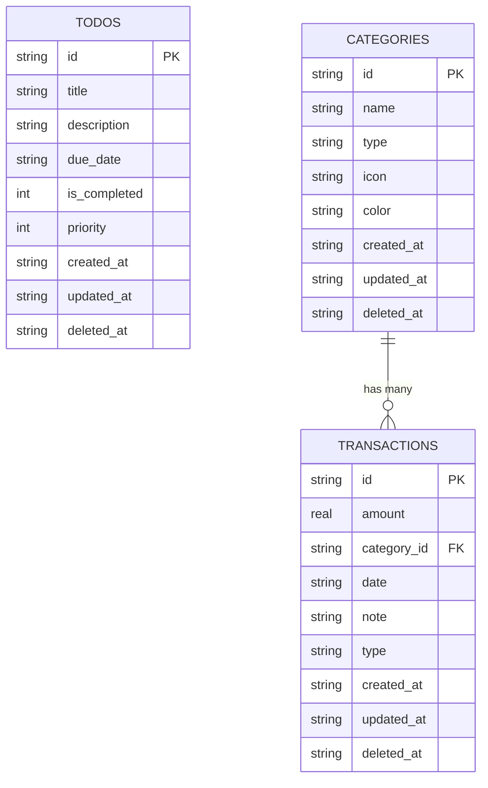

# Database Schema

The **LifeLog** application uses a local **SQLite** database (`lifelog.db`).

## Core Principles

1.  **UUIDs**: All primary keys are UUID strings.
2.  **Soft Deletes**: Rows are never hard-deleted. We set `deleted_at` to a timestamp. This enables future sync capabilities.
3.  **Timestamps**: All tables track `created_at` and `updated_at` (ISO 8601 Strings).
4.  **Booleans**: Stored as `INTEGER` (0 = false, 1 = true) because SQLite lacks a native Boolean type.

## Schema Diagram (ERD)

## Tables

### 1. `todos`

Stores daily tasks and to-do items.

| Column         | Type        | Description                          |
| :------------- | :---------- | :----------------------------------- |
| `id`           | `TEXT` (PK) | Unique UUID.                         |
| `title`        | `TEXT`      | The main task name.                  |
| `description`  | `TEXT`      | Optional details.                    |
| `due_date`     | `TEXT`      | ISO 8601 Date string.                |
| `is_completed` | `INTEGER`   | `0` for pending, `1` for done.       |
| `priority`     | `INTEGER`   | `1` (Low), `2` (Medium), `3` (High). |
| `created_at`   | `TEXT`      | Creation timestamp.                  |
| `updated_at`   | `TEXT`      | Last update timestamp.               |
| `deleted_at`   | `TEXT`      | If present, the item is trash.       |

### 2. `categories`

Categories for income and expenses.

| Column       | Type        | Description                |
| :----------- | :---------- | :------------------------- |
| `id`         | `TEXT` (PK) | Unique UUID.               |
| `name`       | `TEXT`      | e.g., "Food", "Salary".    |
| `type`       | `TEXT`      | `'income'` or `'expense'`. |
| `icon`       | `TEXT`      | Ionicon name string.       |
| `color`      | `TEXT`      | Hex color code.            |
| `created_at` | `TEXT`      | Creation timestamp.        |
| `updated_at` | `TEXT`      | Last update timestamp.     |
| `deleted_at` | `TEXT`      | Soft delete timestamp.     |

### 3. `transactions`

Financial records linked to categories.

| Column        | Type        | Description                             |
| :------------ | :---------- | :-------------------------------------- |
| `id`          | `TEXT` (PK) | Unique UUID.                            |
| `amount`      | `REAL`      | The monetary value.                     |
| `category_id` | `TEXT` (FK) | References `categories(id)`.            |
| `date`        | `TEXT`      | Date of transaction.                    |
| `note`        | `TEXT`      | Optional description.                   |
| `type`        | `TEXT`      | Denormalized `'income'` or `'expense'`. |
| `created_at`  | `TEXT`      | Creation timestamp.                     |
| `updated_at`  | `TEXT`      | Last update timestamp.                  |
| `deleted_at`  | `TEXT`      | Soft delete timestamp.                  |
